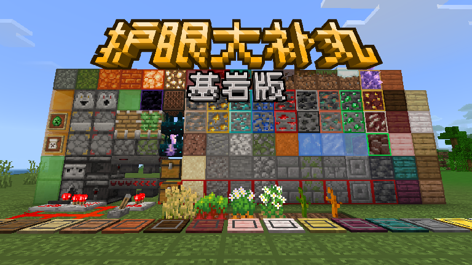

# ProtectMyEyesBE

 

**[简体中文](./README_zh.md) | English**

 

ProtectMyEyes is a Minecraft functional resource pack created by **@黑山大叔 (@hsds)** and ported to the Bedrock Edition by **@橘猫sama (@Jumao)**.

## Main Features
Adds block outlines for most blocks, helping builders and technical survival players count block distances more easily.

## Additional Features

**1. Redstone Information Display**

- Non-Render Dragon versions: Includes chunk borders and redstone signal strength display.

- Render Dragon versions (with shader loaders like BetterRenderDragon or RD Loader): Enables chunk borders, redstone signal display, night vision, light level display, and more.

- Distinguishes between droppers/dispensers, pistons/sticky pistons, pressure plates, and trapped chests.

- Observers and hoppers display their activation state.

- Brushing redstone dust checks signal strength.

- Shows sculk block vibration trails.

- Displays note block pitch and activation count.

**2. Effective Resource Display**

- Highlighted white borders on selected blocks in outline mode.

- Clear, bright borders around ores.

- Glowing ores when using dynamic visuals or ray tracing.

- Shows waxed copper blocks.

- Highlights budding amethyst and mature amethyst clusters.

- Crops bloom when mature; wheat appears greener before ripening.

- Distinguishes melon/pumpkin stems; non-growing kelp tops bloom.

- Shows infested blocks.

- Highlights suspicious sand/gravel.

- Older versions display banner patterns and spawn egg textures.

- More visible explorer map textures.

- Blazes and wither skeletons spawn locations marked for 10 minutes in nether brick areas.

- Happy ghasts show bandages when injured (low HP indicator).

**3. Enhanced UI Features**

- One-click crafting (supports inventory, crafting table, stonecutter, loom).

- Quick item transfer (dispensers, droppers, hoppers, chests) – select specific items for fast moving.

- Villager trade preview & one-click trading.

- Anvil text wrapping (click expand button before editing).

- Structure block import/export on mobile.

- World/template import/export & disable VSync in settings.

- Enable/disable commands in game settings.

- Tab command autocomplete (chat & command blocks).

- Click-to-autofill commands in chat.

- ↑/↓ to cycle through past commands.

- Optimized NetEase magic command module – improved UI, right-side clicks no longer exit the panel.

**4. Detail Optimizations**

- Reduced sounds (end gateways, tridents, pistons, droppers/dispensers) for hearing protection.

- Fixed piston/chest sounds to match Java Edition.

- Corrected coral, bell, etc., block sound errors.

- Added critical hit sounds (Java parity).

- Fixed textures (beds, light blocks, ender dragon fireballs) to match Java Edition.

- Added TGA textures for better performance & reduced distant blur.

- Fixed Bedrock translation errors (using Wiki-based corrections).

- Redesigned UI backgrounds (based on OreUI & updated textures).

- Reduced lag from potion/beacon particles.

- Fewer mob death & crop growth particles.

- Removed nether portal particles.

- Matched Java Edition’s TNT explosion particles.

- More visible wither effect on player health.

- Pumpkin head & spyglass edges now semi-transparent.
